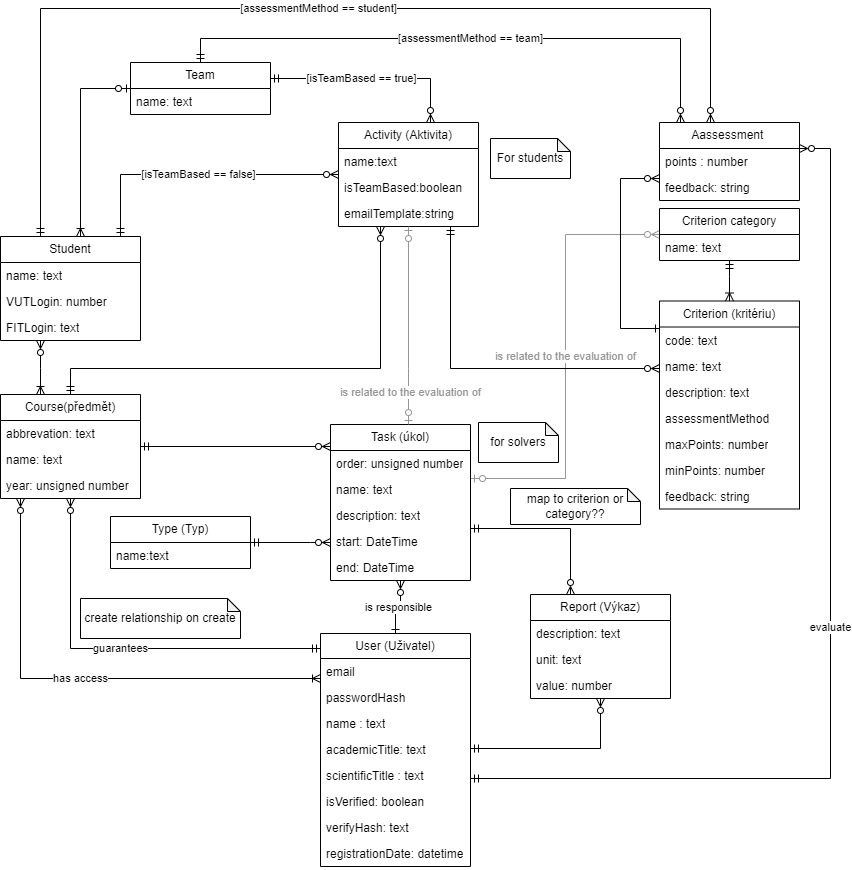
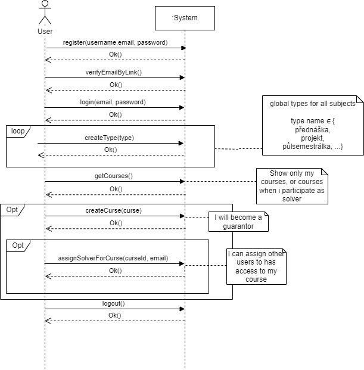
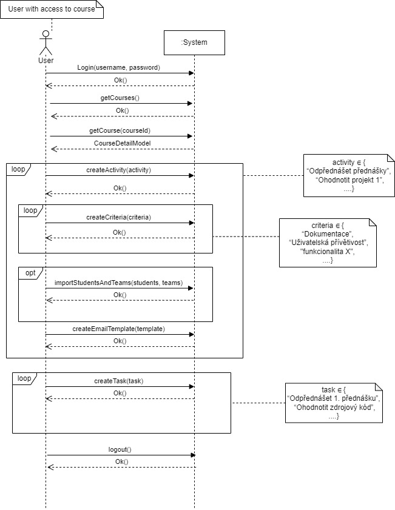
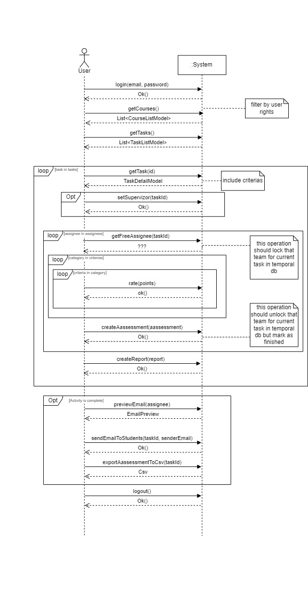
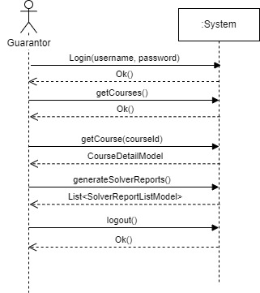
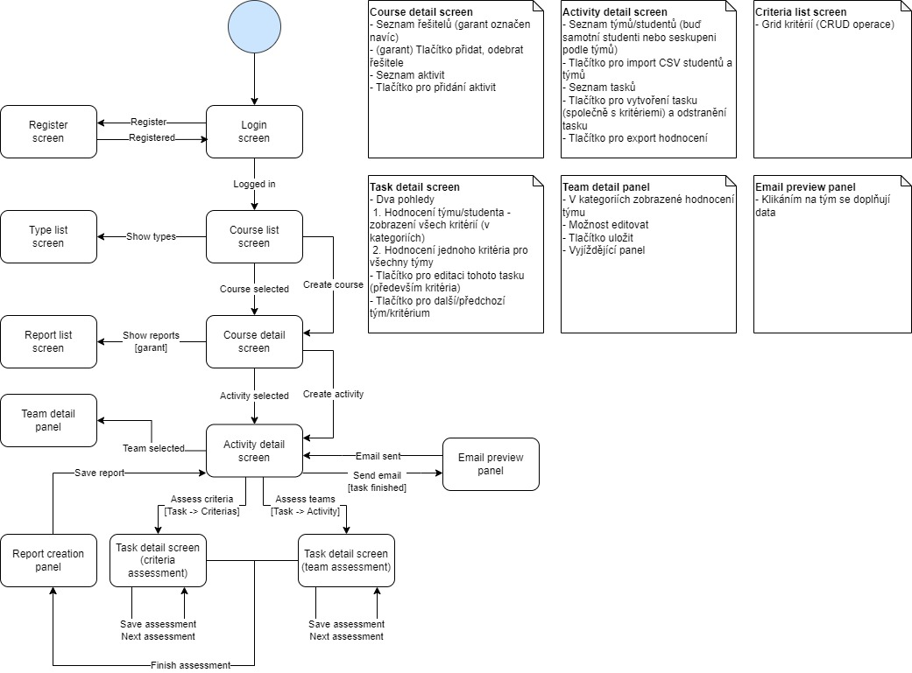

# Application to support teaching in the courses
Organizing a college course is not an easy activity, especially when you have to correct hundreds of projects and then award points to students. Our vice dean tried to address this problem and therefore, as part of his Masters course on Java, he gave us the opportunity to tackle this challenge. The system supports creating courses and importing students from the existing system. It is also possible to create individual projects and assignments for the course for which there are assessment criteria. The ability to send assessment emails to students once an assessment is awarded is not to be missed. Running a course is not only about the students, but also about the PhD students who correct these projects or give lectures and it is necessary to keep track of the work they do.## 

## Design
Before the actual implementation, the problem to be solved had to be understood and correctly modelled. For this purpose, a meeting was made with the client, where we discussed the ambiguities of the assignment.

